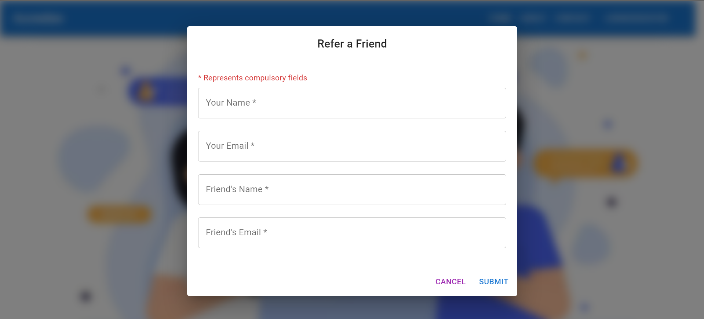

# ReferEarn Frontend

ReferEarn is a React-based web application that allows users to refer friends and earn rewards. The application features a beautiful and responsive design using Material-UI.

## Features

- **Referral System**: Users can refer their friends by providing their names and email addresses.
- **Email Notifications**: Automatic email notifications are sent to the referred friends.
- **Material-UI Design**: The application is styled with Material-UI for a modern and responsive design.
- **Snackbar Notifications**: Users receive real-time feedback on the success or failure of their referral submissions.
- **Dialog Form**: A modal dialog form is used for entering referral information, enhancing user experience.
- **Hero Section**: An engaging hero section with a call-to-action button for referring friends.

## Screenshots


*Hero Section*


*Refer Friend Dialog*

## Installation

### Prerequisites

- Node.js
- npm or yarn

### Steps

1. **Clone the repository:**

   ```sh
   git clone https://github.com/your-username/refer-earn-frontend.git
   cd refer-earn-frontend
